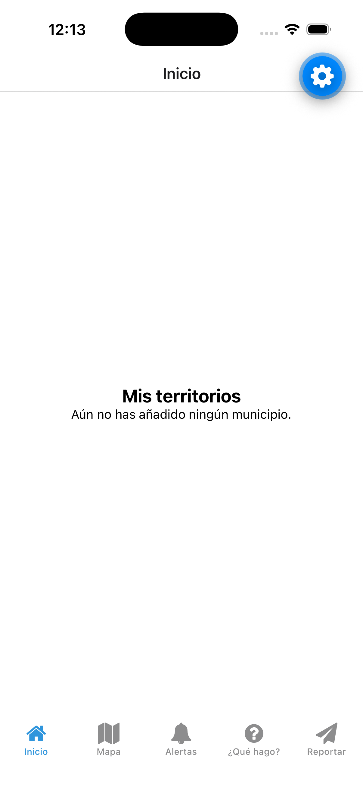
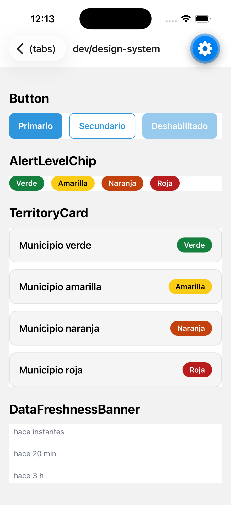
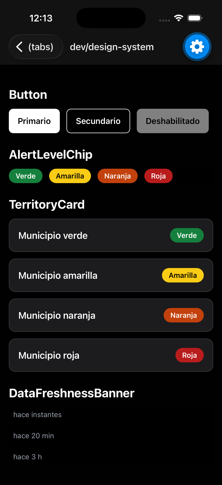

# SAMA Mobile

**Alertas de riesgo hidrometeorológico para el territorio antioqueño, directo al bolsillo de cada ciudadano.**


## Qué es esto

Propuesta y desarrollo de un MVP de aplicación móvil (Android/iOS) para el **SAMA — Sistema de Alerta y Monitoreo de Antioquia**, preparada para el **Dagran** (Departamento Administrativo de Gestión del Riesgo de Desastres de Antioquia).

El SAMA ya instrumenta más de 36 municipios con estaciones meteorológicas, pluviómetros, sensores de nivel y cámaras, y ya genera miles de alertas al año — pero su único canal público es un geoportal web que exige que el ciudadano entre a consultar. En una creciente súbita nocturna, nadie está mirando un portal. Esta app cierra esa brecha: lleva la alerta al celular del ciudadano, con georreferenciación por municipio/cuenca, el estado de las estaciones en un mapa, y recomendaciones claras de qué hacer antes, durante y después de una emergencia.

La propuesta completa (contexto, alcance, arquitectura, cronograma) está en [`docs/proposal/mvp-proposal.md`](docs/proposal/mvp-proposal.md); el backlog de 48 tickets en [`docs/proposal/backlog.md`](docs/proposal/backlog.md).

## Sobre este proyecto

Propuesta técnica y de producto, arquitectura y backlog diseñados por **Sergio Monsalve**. El desarrollo del MVP sigue una disciplina de _spec-driven development_ asistido por agentes de IA: cada cambio parte de una spec versionada con criterios de aceptación, pasa por un plan aprobado antes de tocar código, se entrega en incrementos pequeños y se verifica de verdad (no solo "compila"). El ciclo completo y sus convenciones están en [`CLAUDE.md`](CLAUDE.md) y en [`docs/specs/`](docs/specs/).

## Alcance del MVP

- **Alertas push georreferenciadas** por municipio/cuenca, con niveles verde/amarilla/naranja/roja.
- **Mapa de estaciones en tiempo real** (pluviómetros, sensores de nivel, cámaras) con tendencia 24–72h.
- **"¿Qué hago?"** — recomendaciones offline de antes/durante/después por tipo de evento, y directorio de emergencia.
- **Reporte ciudadano** — foto + ubicación + categoría, con moderación del equipo del Dagran.
- Funciona con conectividad intermitente (caché local con antigüedad visible) y cumple accesibilidad básica (AA, lectores de pantalla).

Detalle completo de alcance, lo que queda explícitamente fuera del MVP, y las 4 fases del plan de trabajo: [`docs/proposal/mvp-proposal.md`](docs/proposal/mvp-proposal.md).

## Stack técnico

- **App (este repo):** Expo + TypeScript, Expo Router, React Native.
- **Backend (repo aparte, futuro):** Node.js/NestJS, PostgreSQL + PostGIS, Redis — ver [`docs/adr/0001-repos-separados-app-bff.md`](docs/adr/0001-repos-separados-app-bff.md) para por qué son dos repos.
- **Notificaciones push:** Firebase Cloud Messaging + APNs vía Expo Notifications.
- **Mapas:** MapLibre GL.

## Estado actual

El harness (esqueleto de la app, tooling, CI, convenciones de spec/ADR) y el sistema de diseño (tokens + componentes base) ya están mergeados a `main`. En este momento se está construyendo el onboarding (E1-03). Ver el backlog para el detalle de épicas y su estado.

## Capturas

| Los 5 tabs (Expo Router)           | Sistema de diseño — claro                                        | Sistema de diseño — oscuro                                       |
| ---------------------------------- | ---------------------------------------------------------------- | ---------------------------------------------------------------- |
|  |  |  |

El catálogo del sistema de diseño (`Button`, `AlertLevelChip`, `TerritoryCard`, `DataFreshnessBanner`) vive en una ruta de desarrollo (`/dev/design-system`, fuera de la navegación de tabs) y no es parte del flujo del usuario final — es la herramienta con la que se verifica visualmente cada componente en claro y oscuro antes de usarlo en una pantalla real.

## Cómo correrlo

Requisitos: Node.js 22+, npm. Para correr en un simulador de iOS necesitas Xcode instalado (Mac); para Android, Android Studio con un emulador configurado. También puedes probarlo sin instalar nada extra usando la app **Expo Go** en tu propio celular (ver abajo).

```bash
npm install
npm start
```

Esto abre el menú interactivo de Expo en la terminal:

- presiona **i** para abrir en el simulador de iOS
- presiona **a** para abrir en el emulador de Android
- presiona **w** para abrir la versión web en el navegador

**Desde tu celular (sin simulador):** instala "Expo Go" desde la App Store o Play Store, asegúrate de estar en la misma red WiFi que tu computador, y escanea el código QR que aparece en la terminal al correr `npm start`. Nota: Expo Go en la tienda solo soporta la versión de SDK de Expo más reciente que haya publicado — si este proyecto usa un SDK más nuevo que el que soporta la app de la tienda, esa vía no va a funcionar hasta que Expo Go se actualice (usa el simulador o la versión web mientras tanto).

Otros comandos:

```bash
npm run lint        # ESLint
npm run typecheck   # tsc --noEmit
npm test            # Jest
npm run format      # Prettier (escribe cambios)
npm run format:check # Prettier sin escribir, falla si algo está mal formateado
```

## Estructura del proyecto

- `app/` — pantallas y navegación (Expo Router, basado en archivos).
- `docs/proposal/` — la propuesta del MVP y el backlog completo.
- `docs/specs/` — specs de cada ciclo de trabajo, versionadas.
- `docs/adr/` — decisiones de arquitectura documentadas.
- `docs/DEFINITION_OF_DONE.md` — checklist de cierre para cualquier ticket.
- `CLAUDE.md` — el ciclo de desarrollo y las convenciones del repo, para humanos y agentes de IA.
