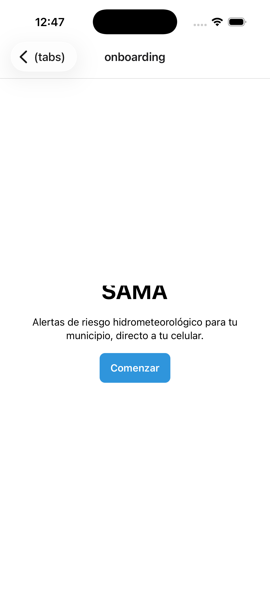
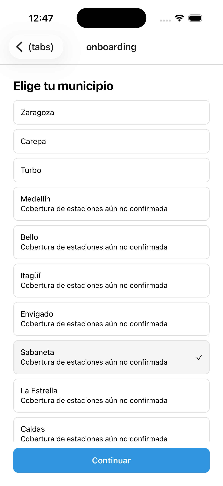
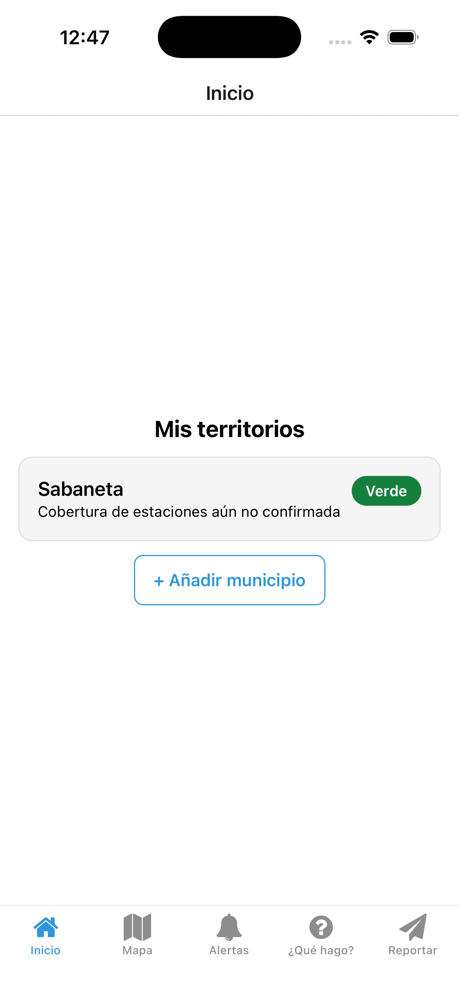
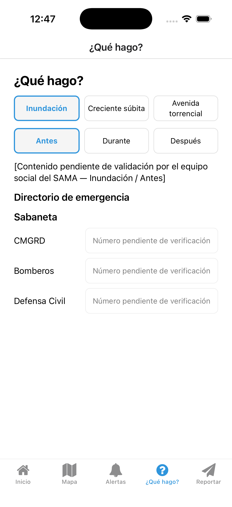
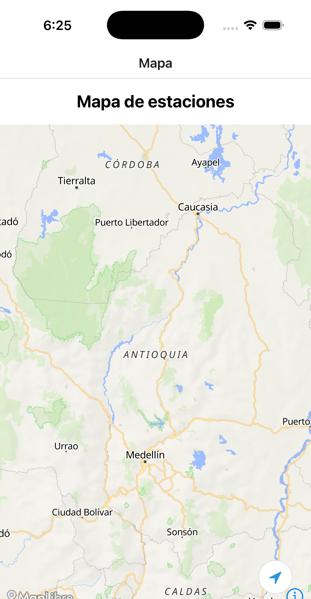
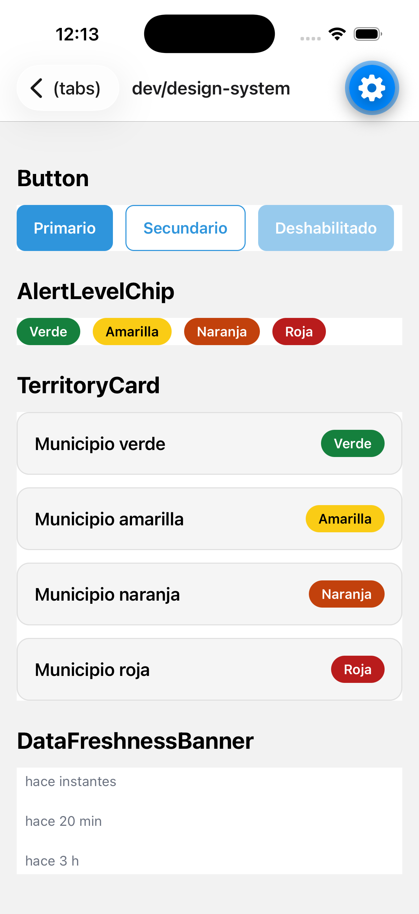
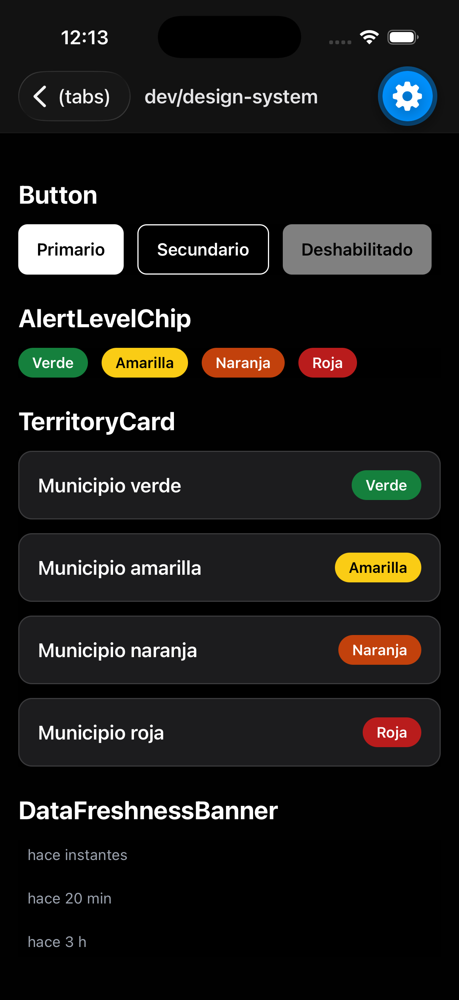

# SAMA Mobile

**Alertas de riesgo hidrometeorológico para el territorio antioqueño, directo al bolsillo de cada ciudadano.**


## Qué es esto

Propuesta y desarrollo de un MVP de aplicación móvil (Android/iOS) para el **SAMA — Sistema de Alerta y Monitoreo de Antioquia**, preparada para el **Dagran** (Departamento Administrativo de Gestión del Riesgo de Desastres de Antioquia).

El SAMA ya instrumenta más de 36 municipios con estaciones meteorológicas, pluviómetros, sensores de nivel y cámaras, y ya genera miles de alertas al año — pero su único canal público es un geoportal web que exige que el ciudadano entre a consultar. En una creciente súbita nocturna, nadie está mirando un portal. Esta app cierra esa brecha: lleva la alerta al celular del ciudadano, con georreferenciación por municipio/cuenca, el estado de las estaciones en un mapa, y recomendaciones claras de qué hacer antes, durante y después de una emergencia.

La propuesta completa (contexto, alcance, arquitectura, cronograma) está en [`docs/proposal/mvp-proposal.md`](docs/proposal/mvp-proposal.md); el backlog de 48 tickets en [`docs/proposal/backlog.md`](docs/proposal/backlog.md).

## Sobre este proyecto

Propuesta técnica y de producto, arquitectura y backlog diseñados por **Sergio Monsalve**. El desarrollo del MVP sigue una disciplina de _spec-driven development_ asistido por agentes de IA: cada cambio parte de una spec versionada con criterios de aceptación, pasa por un plan aprobado antes de tocar código, se entrega en incrementos pequeños y se verifica de verdad (no solo "compila"). El ciclo completo y sus convenciones están en [`CLAUDE.md`](CLAUDE.md) y en [`docs/specs/`](docs/specs/).

## Alcance del MVP

- **Alertas push georreferenciadas** por municipio/cuenca, con niveles verde/amarilla/naranja/roja.
- **Mapa de estaciones en tiempo real** (pluviómetros, sensores de nivel, cámaras) con tendencia 24–72h.
- **"¿Qué hago?"** — recomendaciones offline de antes/durante/después por tipo de evento, y directorio de emergencia.
- **Reporte ciudadano** — foto + ubicación + categoría, con moderación del equipo del Dagran.
- Funciona con conectividad intermitente (caché local con antigüedad visible) y cumple accesibilidad básica (AA, lectores de pantalla).

Detalle completo de alcance, lo que queda explícitamente fuera del MVP, y las 4 fases del plan de trabajo: [`docs/proposal/mvp-proposal.md`](docs/proposal/mvp-proposal.md).

## Stack técnico

- **App (este repo):** Expo + TypeScript, Expo Router, React Native.
- **Backend (repo aparte, futuro):** Node.js/NestJS, PostgreSQL + PostGIS, Redis — ver [`docs/adr/0001-repos-separados-app-bff.md`](docs/adr/0001-repos-separados-app-bff.md) para por qué son dos repos.
- **Notificaciones push:** Firebase Cloud Messaging + APNs vía Expo Notifications.
- **Mapas:** MapLibre GL.

## Estado actual

8 ciclos de trabajo mergeados a `main`, cada uno con su spec, plan de implementación y revisión de código (ver [`docs/specs/`](docs/specs/) y [`docs/superpowers/plans/`](docs/superpowers/plans/)):

- ✅ **Harness** (adaptado de E0-05) — esqueleto de la app, tooling, CI, convenciones de spec/ADR.
- ✅ **E1-02** — sistema de diseño en código (tokens + componentes base).
- ✅ **E1-03** — onboarding sin cuenta (bienvenida → municipio(s) → notificaciones).
- ✅ **E1-05** — accesibilidad base (roles/estados de lector de pantalla, targets táctiles ≥44px).
- ✅ **E5-01** — módulo "¿Qué hago?" (recomendaciones antes/durante/después por tipo de evento).
- ✅ **Ampliación de municipios** — el selector de onboarding pasó de 3 a 28 municipios (Valle de Aburrá + los 15 más poblados del resto de Antioquia, población DANE), con aviso explícito de cuáles tienen estaciones SAMA confirmadas y cuáles no.
- ✅ **E5-02** — directorio de emergencia por municipio (CMGRD, Bomberos, Defensa Civil), con botón de llamada real listo para cuando exista un teléfono verificado.
- ✅ **E3-01** — mapa base con MapLibre, centrado en Antioquia con tiles reales de OpenFreeMap, y botón de ubicación opt-in. Primera dependencia nativa del proyecto — ver la nota en "Cómo correrlo" sobre qué implica para el tab "Mapa".

### Qué falta

Siguiente en el backlog, sin bloqueo externo:

- **E6-01** — formulario de reporte ciudadano (foto + ubicación + categoría, cola offline).

Todo lo demás depende de trabajo que no se resuelve solo con código en este repo:

- **El BFF** (backend, repo aparte) no existe todavía — bloquea el mapa con datos reales, las alertas push, y una caché offline con sentido (E1-04, épicas E2/E3-02/E3-03/E4).
- **E0-02** (inventario y prueba de fuentes de datos SAMA) y el resto de la épica E0 requieren trabajo directo con Dagran/G-LIMA — talleres, acceso a APIs reales, protocolo de niveles firmado. No es código, es gestión del proyecto.
- **Contenido real** (recomendaciones de "¿Qué hago?" validadas por el equipo social del SAMA, teléfonos de emergencia reales) queda intencionalmente marcado como pendiente en la app — no se fabricó contenido de protección civil ni números de emergencia sin una fuente verificable, tratándose de una app de alertas para emergencias reales.

Detalle completo de las 48 tareas originales y su estado: [`docs/proposal/backlog.md`](docs/proposal/backlog.md).

## Capturas

| Onboarding                                             | Selector de municipio (28, con aviso de cobertura)                   | Inicio                                 | "¿Qué hago?" + directorio                  | Mapa (MapLibre)                    |
| ------------------------------------------------------ | -------------------------------------------------------------------- | -------------------------------------- | ------------------------------------------ | ---------------------------------- |
|  |  |  |  |  |

| Sistema de diseño — claro                                        | Sistema de diseño — oscuro                                       |
| ---------------------------------------------------------------- | ---------------------------------------------------------------- |
|  |  |

El catálogo del sistema de diseño (`Button`, `AlertLevelChip`, `TerritoryCard`, `DataFreshnessBanner`) vive en una ruta de desarrollo (`/dev/design-system`, fuera de la navegación de tabs) y no es parte del flujo del usuario final — es la herramienta con la que se verifica visualmente cada componente en claro y oscuro antes de usarlo en una pantalla real.

## Cómo correrlo

Requisitos: Node.js 22+, npm. Para correr en un simulador de iOS necesitas Xcode instalado (Mac); para Android, Android Studio con un emulador configurado.

```bash
npm install
npm start
```

Esto abre el menú interactivo de Expo en la terminal:

- presiona **i** para abrir en el simulador de iOS
- presiona **a** para abrir en el emulador de Android
- presiona **w** para abrir la versión web en el navegador

### ⚠️ El tab "Mapa" necesita una build nativa, no funciona en Expo Go

Desde E3-01, la app usa `@maplibre/maplibre-react-native` para el mapa — es la primera dependencia nativa del proyecto. **Todas las demás pantallas siguen funcionando normalmente en Expo Go**; solo el tab "Mapa" específicamente falla ahí (error `TurboModuleRegistry.getEnforcing(...): 'MLRNCameraModule' could not be found`) porque ese módulo no viene incluido en la app de Expo Go de la tienda. Para ver el mapa de verdad necesitas la build nativa de la sección de abajo (`npx expo run:ios` / `run:android`), no `npm start` + Expo Go.

### Desde tu celular, con Expo Go (sin cable, más rápido — pero sin el tab "Mapa")

Instala "Expo Go" desde la App Store o Play Store, asegúrate de estar en la misma red WiFi que tu computador, y escanea el código QR que aparece en la terminal al correr `npm start`.

**Limitación conocida:** Expo Go de la tienda solo soporta la versión de SDK de Expo más reciente que haya publicado. Si este proyecto usa un SDK más nuevo que el que soporta la app de la tienda (mensaje "Project is incompatible with this version of Expo Go"), esa vía no va a funcionar hasta que Expo Go se actualice — usa el simulador, la versión web, o la build nativa de abajo mientras tanto.

### Desde tu celular, con una build nativa (necesaria para el mapa; también evita la limitación de Expo Go)

Conecta el iPhone por cable USB a una Mac con Xcode instalado, activa "Modo desarrollador" en el teléfono (Ajustes → Privacidad y seguridad) y confía en la computadora cuando lo pida. Luego:

```bash
npx expo run:ios --device
```

Esto genera el proyecto nativo (`expo prebuild`), instala CocoaPods si falta, compila con Xcode e instala la app directamente en el teléfono — sin pasar por Expo Go, así que no importa qué SDK soporte la app de la tienda, y el tab "Mapa" funciona. La primera compilación tarda varios minutos; las siguientes son más rápidas. Requiere una cuenta de Apple (gratuita) configurada como equipo de firma en Xcode (Xcode → Settings → Accounts).

Para el simulador de iOS, el mismo comando funciona apuntando a un simulador booteado: `npx expo run:ios --device <nombre-o-udid-del-simulador>`.

Otros comandos:

```bash
npm run lint        # ESLint
npm run typecheck   # tsc --noEmit
npm test            # Jest
npm run format      # Prettier (escribe cambios)
npm run format:check # Prettier sin escribir, falla si algo está mal formateado
```

## Estructura del proyecto

- `app/` — pantallas y navegación (Expo Router, basado en archivos).
- `docs/proposal/` — la propuesta del MVP y el backlog completo.
- `docs/specs/` — specs de cada ciclo de trabajo, versionadas.
- `docs/superpowers/plans/` — planes de implementación de cada ciclo.
- `docs/adr/` — decisiones de arquitectura documentadas.
- `docs/DEFINITION_OF_DONE.md` — checklist de cierre para cualquier ticket.
- `CLAUDE.md` — el ciclo de desarrollo y las convenciones del repo, para humanos y agentes de IA.
